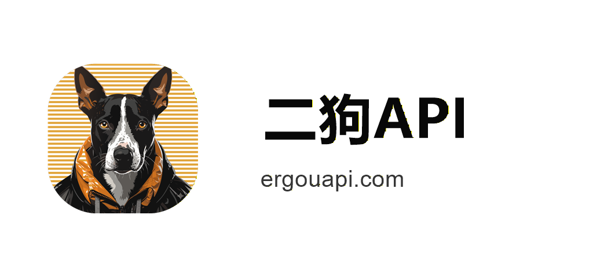

# Codex++

<p align="center">
  
</p>

<p align="center">
  中文 | <a href="README_EN.md">English</a>
</p>

<p align="center">
  
  
  
  
  
</p>

Codex++ 是面向 Codex App 的外部增强启动器和管理工具。它不修改 Codex App 原始安装文件，而是通过外部 launcher 启动 Codex，并使用 Chromium DevTools Protocol 注入增强脚本。

## 快速使用

从 [GitHub Releases](https://github.com/BigPizzaV3/CodexPlusPlus/releases) 下载最新版安装包：

- Windows：`CodexPlusPlus-*-windows-x64-setup.exe`
- macOS Intel：`CodexPlusPlus-*-macos-x64.dmg`
- macOS Apple Silicon：`CodexPlusPlus-*-macos-arm64.dmg`

安装后会有两个入口：

- `Codex++`：静默启动入口，不显示管理界面，只负责启动 Codex 并注入增强功能。
- `Codex++ 管理工具`：Tauri 控制面板，用于启动、检查、修复、更新、配置中转注入、管理增强功能和用户脚本。

Windows 安装包会创建桌面和开始菜单快捷方式。macOS DMG 会安装 `/Applications/Codex++.app` 和 `/Applications/Codex++ 管理工具.app`。

## 赞助商

<p align="center">
  <a href="https://jojocode.com/">
    
  </a>
</p>
<p align="center">
  <a href="https://jojocode.com/"><strong>JOJO Code｜Codex++ 官方中转站</strong></a><br>
  Codex++ 官方中转站，主打稳定接入和划算价格，支持 GPT-5.5、GPT-5.4、Claude Opus 4.8、Claude Opus 4.7、gpt-image-2 等模型与图像能力，适合日常开发、团队协作和长期项目工作流。
</p>

<a href="mailto:1727532@qq.com">想显示在下方？</a>
<p align="center">
</p>
<table>
  <tr>
    <th width="180">🏆 赞助商 🏆</th>
    <th>介绍</th>
  </tr>
  <tr>
    <td align="center">
      <a href="https://jojocode.com/">
        
      </a>
    </td>
    <td><a href="https://jojocode.com/"><strong>JOJO Code｜Codex++ 官方中转站</strong></a><br>感谢 JOJO Code 赞助本项目。JOJO Code 是 Codex++ 官方中转站，提供价格划算、稳定易接入的 Codex API 中转服务，支持 GPT-5.5、GPT-5.4、Claude Opus 4.8、Claude Opus 4.7、gpt-image-2 等模型与图像能力，适合日常开发、快速配置、团队协作和长期使用。</td>
  </tr>
  <tr>
    <td align="center">
      <a href="https://aigocode.com/invite/CodexPlusPlus">
        
      </a>
    </td>
    <td><a href="https://aigocode.com/invite/CodexPlusPlus"><strong>AIGoCode</strong></a><br>感谢 AIGoCode 赞助了本项目！AIGoCode 是一个集成了 Claude Code、Codex 以及 Gemini 最新模型的一站式平台，为你提供稳定、高效且高性价比的AI编程服务。本站提供灵活的订阅计划，支持多风险，国内直连，无需魔法，极速响应。AIGoCode 为 CodexPlusPlus 的用户提供了特别福利，通过<a href="https://aigocode.com/invite/CodexPlusPlus">此链接注册</a>的用户首次充值可以获得额外10%奖励额度！</td>
  </tr>
  <tr>
    <td align="center">
      <a href="https://apikey.fun/register?aff=CODEX">
        
      </a>
    </td>
    <td><a href="https://apikey.fun/register?aff=CODEX"><strong>APIKEY.FUN</strong></a><br>感谢 APIKEY.FUN 赞助了本项目！APIKEY.FUN 是一家致力于提供开放、稳定、高性价比的全球主流大模型的 AI 中转站。平台支持 Claude、OpenAI、Gemini 等热门模型的 API 中转服务，价格低至官方原价的 7%。通过专属链接<a href="https://apikey.fun/register?aff=CODEX">注册 APIKEY</a>，可享受最高充值永久 95 折优惠。</td>
  </tr>
  <tr>
    <td align="center">
      <a href="https://runapi.co/register?aff=AWJq">
        
      </a>
    </td>
    <td><a href="https://runapi.co/register?aff=AWJq"><strong>RunAPI</strong></a><br>感谢 RunAPI 赞助了本项目！RunAPI 是高效稳定的 API OpenRouter 平替平台，一个 API Key 即可访问 OpenAI、Claude、Gemini、DeepSeek、Grok 等 150+ 主流模型，低至 1 折，极其稳定，可以无缝兼容 Claude Code、OpenClaw 等工具。</td>
  </tr>
  <tr>
    <td align="center">
      <a href="https://cubence.com?source=codexplusplus">
        
      </a>
    </td>
    <td><a href="https://cubence.com?source=codexplusplus"><strong>Cubence</strong></a><br>感谢 Cubence 对本项目的支持。Cubence 是一家致力为客户提供稳定、高效的 API 中转服务商。从 25 年 9 月运营至今，提供了 Claude Code、Codex、Gemini 等多种模型支持。Cubence 为本开源项目多用户提供了特别的专属优惠 <code>CODEXPLUSPLUS</code>，在首次购买时享受 8.8 折优惠！</td>
  </tr>
  <tr>
    <td align="center">
      <a href="https://www.0029.org/?promo=AFF11F">
        
      </a>
    </td>
    <td><a href="https://www.0029.org/?promo=AFF11F"><strong>0029云桥｜codex api中转站(gpt5.5 gpt-image-2)</strong></a><br>支持个人和企业接入。包月套餐/按量计费，Pro/Plus 号池，全站接口稳定可用，7×24 小时技术支持！</td>
  </tr>
  <tr>
    <td align="center">
      <a href="https://unity2.ai/register?source=codexplusplus">
        
      </a>
    </td>
    <td><a href="https://unity2.ai/register?source=codexplusplus"><strong>Unity2.ai</strong></a><br>感谢 Unity2.ai 赞助了本项目！Unity2.ai 是面向个人开发者、团队和企业的高性能 AI 模型 API 中转平台，长期服务国内头部企业，日均承载超 300 亿 token 调用，支持 5000 RPM 级高并发。支持余额计费、首充赠额、组合订阅、企业开票和专属对接。通过<a href="https://unity2.ai/register?source=codexplusplus">此链接注册</a>可领取 $2 余额，加入官方群再送 $10 余额，最高可领 $12 免费额度。</td>
  </tr>
  <tr>
    <td align="center">
      <a href="https://api.icreat.ai">
        
      </a>
    </td>
    <td><a href="https://api.icreat.ai"><strong>iCreat API</strong></a><br>感谢 iCreat API 赞助了本项目！iCreat API 是面向个人开发者、团队和企业的高性能 AI 模型 API 中转平台，稳定接入官方渠道，覆盖谷歌、火山、昆仑万维、腾讯云等开白名单资源。平台集成 Anthropic、ByteDance、OpenAI、DeepSeek、Google、Minimax、Kwai 等主流供应商，提供超 60 款模型调用，并通过统一控制台支持多维度模型筛选、计费类型管理和分组权限控制。支持 Pay as you go 与余额计费，企业用户可正常开票并获得专属对接服务。</td>
  </tr>
  <tr>
    <td align="center">
      <a href="https://github.com/Liuchun-oss/codelf-agent">
        
      </a>
    </td>
    <td><a href="https://github.com/Liuchun-oss/codelf-agent"><strong>Codelf</strong></a><br>Codelf 是内置自主式 AI Agent 的桌面应用，也是一款完整编辑器。它支持用自然语言开发项目、整理资料、操作电脑和调用本地程序，国内可直接使用，支持多家大模型，并通过高上下文缓存命中降低使用成本。</td>
  </tr>
  <tr>
    <td align="center">
      <a href="https://xc.y1yun.net/">
        
      </a>
    </td>
    <td><a href="https://xc.y1yun.net/"><strong>屹芸科技</strong></a><br>屹芸科技旗下拥有九五云商发卡网、屹芸付支付系统等面向 AI 聚合赛道的收付产品，支持微信、支付宝、银联、云闪付等通道，提供低费率、D1/D0 结算、7×24 小时技术支持和企微客户专属服务群。平台通道费率稳定、结算准时，并提供高强度网站防护，帮助商户稳定开展线上销售。</td>
  </tr>
  <tr>
    <td align="center">
      <a href="https://sui-xiang.com/">
        
      </a>
    </td>
    <td><a href="https://sui-xiang.com/"><strong>随想AI网关</strong></a><br>感谢随想AI网关对本项目的赞助！随想AI网关是一家可靠高效的 API 中继服务提供商，提供 Claude、Codex、Gemini 等中继服务，注重隐私，承诺无数据倒卖、无模型掺水，并提供透明、快速的售后支持。新账户注册每日签到送 0.5 元测试额度，充值额度 1:1，无需订阅，按量付费。</td>
  </tr>
  <tr>
    <td align="center">
      <a href="https://dis.chatdesks.cn/chatdesk/hsyqCodexPlusPlus.html">
        
      </a>
    </td>
    <td><a href="https://dis.chatdesks.cn/chatdesk/hsyqCodexPlusPlus.html"><strong>火山引擎｜方舟 Agent Plan</strong></a><br>感谢火山引擎赞助本项目！方舟 Agent Plan 模型订阅套餐集成了 Doubao-Seed、Doubao-Seedance、Doubao-Seedream 等字节跳动自研 SOTA 级模型，覆盖文本、代码、图像、视频等多模态任务。最新支持 MiniMax-M3、DeepSeek-V4 系列、GLM-5.2、Doubao-Seed-2.0 系列、Kimi-K2.7 等模型，工具不限。超全模态模型与 Harness 升级一步到位，深度支持 Agent 框架与 AI 编程工具。一次订阅，可以为不同任务切换合适的 AI 引擎。方舟 Agent Plan 限时 2.5 折订阅，<a href="https://dis.chatdesks.cn/chatdesk/hsyqCodexPlusPlus.html">点击链接抢购</a>，名额有限，先到先得。<a href="https://www.byteplus.com/en/product/modelark?utm_campaign=hw&amp;utm_content=CodexPlusPlus&amp;utm_medium=devrel_tool_web&amp;utm_source=OWO&amp;utm_term=CodexPlusPlus">For developers outside Mainland China, please click here</a>。</td>
  </tr>
  <tr>
    <td align="center">
      <a href="https://smallice.xyz/register?aff=FSNMGR2THBLN">
        
      </a>
    </td>
    <td><a href="https://smallice.xyz/register?aff=FSNMGR2THBLN"><strong>Smallice｜AI 中转站</strong></a><br>感谢 Smallice 赞助本项目！Smallice 是一把钥匙，通往所有值得调用的语言模型。一个统一的 endpoint，作为你应用之下、无需多言的基础层。无论你召唤的是 Claude、GPT、Gemini 还是 DeepSeek，调用的形式从此恒等。通过<a href="https://smallice.xyz/register?aff=FSNMGR2THBLN">此链接注册</a>即可开始使用。</td>
  </tr>
  <tr>
    <td align="center">
      <a href="https://ergouapi.com">
        
      </a>
    </td>
    <td><a href="https://ergouapi.com"><strong>二狗 API</strong></a><br>二狗，稳如老狗的 AI API 中转站。全站 0.1x~0.2x 超低倍率，提供 Claude/GPT/Gemini 等多个国内外 100% 纯血大模型接口，顶级 IPLC 线路 + 住宅双 ISP 冗余，确保全国范围稳定低延迟访问。欢迎各位开发者、工作室注册使用。</td>
  </tr>
  <tr>
    <td align="center">
      <a href="https://aihub.top/register?aff=ZYD8UJV274HD">
        
      </a>
    </td>
    <td><a href="https://aihub.top/register?aff=ZYD8UJV274HD"><strong>AIHub</strong></a><br>AIHub 是一家面向个人开发者和企业团队的高可用 AI 模型 API 中转平台。支持 Codex / ClaudeCode，价格约为官方 1 折不到。我们不生产 Token，我们是 Token 搬运工！通过<a href="https://aihub.top/register?aff=ZYD8UJV274HD">此链接注册</a>并使用优惠码 <code>CODEXPLUSPLUS</code>，即可获得 3$ 测试额度。</td>
  </tr>
</table>

## 交流与支持

欢迎加入 Codex++ 交流群（QQ群：830629290），反馈问题、交流使用体验或提出新功能建议。

微信群：<a href="https://docs.qq.com/doc/DQ2VOanZTTFZJcUpZ#">点击这里获取最新微信群二维码</a>。


Telegram 频道：<https://t.me/CodexPlusPlus>

如果 Codex++ 帮到了你，可以请我喝杯咖啡，或者随手赞赏支持一下继续维护。

<p align="center">
  
  
</p>

## 主要功能

- Rust 后端和静默 launcher，启动时不依赖额外运行时。
- Tauri + React 管理工具，支持深色/浅色切换。
- 外部 CDP 注入，不改 `app.asar`，不向 Codex 安装目录写入 DLL。
- 中转注入模式：支持多个中转配置，写入 `CodexPlusPlus` provider，并可切回官方 ChatGPT 登录态。
- 传统增强模式：插件市场解锁、会话删除、Markdown 导出、项目移动等。
- 粘贴修复：从 Word 等富文本来源粘贴到 Codex composer 时只保留纯文本，避免被识别为图片/文件附件。默认关闭，启用后需重启 Codex 才生效。
  - **使用提示**：管理工具里勾选后需点「保存增强设置」按钮才会写盘，然后重启 Codex++ 才会生效。
- Stepwise 下一步建议：在 Codex 对话页显示可拖动的 Stepwise 浮层，基于当前用户意图和最新助手回复生成后续操作建议；可配置独立 Base URL、API Key、模型、建议数量和是否点击后直接发送。
- 用户脚本独立管理，可在启动时注入自定义脚本。
- Provider 同步：启动前同步本地会话 metadata，切换供应商后旧会话仍可见。
- Zed 打开入口：识别远程 SSH 上下文后，可从 Codex 直接打开对应文件到 Zed Remote Development。
- 按模型粒度配置上下文窗口：「模型列表」分为左右两列，左侧填模型名，右侧填上下文窗口（如 `1M`、`200K` 或 `1000000`）；Codex++ 自动生成 `model_catalog_json` 并注入 `config.toml`，切换模型即生效。右侧留空则使用 Codex 默认长度。
- Upstream worktree 创建：可从 `upstream/<base-branch>` 创建新 worktree，创建前自动 fetch 远端分支，降低从陈旧本地 HEAD 派生导致的冲突风险。
- GitHub Release 自动更新，管理工具和静默启动器都会检测可用更新。
- Windows 单实例、无黑框启动、管理员权限清单、系统桌面路径识别。
- macOS x64/arm64 分架构 DMG，静默入口隐藏 Dock 图标。

## 痛点与解决

API Key 登录模式下，Codex 原生插件市场会提示需要登录 ChatGPT，导致插件功能无法正常使用：


Codex 原生会话列表只有归档入口，没有真正的删除按钮：


Codex++ 启动后会解锁插件市场能力，并在会话列表悬停时显示删除按钮：


顶部菜单栏会出现 `Codex++`，可以查看后端状态并打开设置面板：


## 中转注入

中转注入适合已经在 Codex/ChatGPT 中完成官方账号登录，同时希望把模型请求转到自定义兼容 API 的场景。

这种混合模式的边界是：

- 官方 ChatGPT/Codex 登录态继续负责 Codex App 的账号能力和插件入口。
- 中转配置只接管模型请求使用的 Base URL、Key 和模型名称。
- 兼容 API 供应商不需要固定为某一家；只要上游协议和 Codex 配置匹配即可。
- 清除 API 模式后应能回到官方登录态，继续使用官方账号和插件。

应用中转注入前建议先做一次最小检查：

1. 先确认 Codex 已检测到 ChatGPT 登录状态，插件入口可用。
2. 确认自定义 Base URL 可访问，并且支持所选上游协议（例如 Responses 兼容接口）。
3. 用目标 Key 做一次最小认证测试，例如模型列表或很短的消息请求。
4. 只记录 Key 是否存在和认证结果，不要把真实 Key 写入日志、截图或 issue。
5. 确认 `~/.codex/config.toml` 已有备份，便于清除 API 模式后回滚。

在管理工具的“中转注入”页面：

1. 确认已经检测到 ChatGPT 登录状态。
2. 添加一个或多个中转配置，填写 Base URL 和 Key。
3. 选择当前配置并应用中转注入。
4. 启动 `Codex++`。

Codex++ 会在 `~/.codex/config.toml` 中写入类似配置：

```toml
model_provider = "CodexPlusPlus"

[model_providers.CodexPlusPlus]
name = "CodexPlusPlus"
wire_api = "responses"
requires_openai_auth = true
base_url = "https://example.com/v1"
experimental_bearer_token = "sk-..."
```

如果需要回到官方登录态，在“中转注入”页面点击清除 API 模式即可移除 `OPENAI_API_KEY` 相关配置并切回官方 ChatGPT 登录模式。

## 增强功能

增强功能在管理工具中统一开关。默认开启增强注入；关闭后不会注入 Codex++ 菜单和脚本。

如果启用中转注入模式，插件市场解锁不再需要，界面会提示“中转注入模式下无需开启”。会话删除、导出、移动、粘贴修复、推荐内容和用户脚本等增强仍可继续使用。

## 推荐内容

推荐内容来自远程广告列表：

```text
https://raw.githubusercontent.com/BigPizzaV3/Ad-List/main/ads.json
https://cdn.jsdelivr.net/gh/BigPizzaV3/Ad-List@main/ads.json
```

请求时会自动追加 `?v=时间戳` 绕开 CDN 旧缓存。推荐内容加载慢不会影响后端连接状态。

## 自动更新与安装包

Codex++ 通过 GitHub Release 发布安装包。Windows 会生成 NSIS 安装程序，macOS 会生成 Intel x64 和 Apple Silicon arm64 两个 DMG。

管理工具的“关于”页可以检查并启动更新。静默启动器发现新版本时会拉起管理工具并进入更新提示。

## 数据位置

- Codex 配置：`~/.codex/config.toml`
- Codex 登录状态：`~/.codex/auth.json`
- Codex 本地数据库：优先读取 `~/.codex/sqlite/*.db`，旧版回退到 `~/.codex/state_5.sqlite`
- Codex++ 状态与日志：`~/.codex-session-delete/`
- Provider 同步备份：`~/.codex/backups_state/provider-sync`

## 常见问题

### Codex++ 菜单没出现

确认是从 `Codex++` 入口启动，而不是原版 Codex。也可以打开管理工具的“诊断”和“日志”页面查看注入状态。

### 插件内显示后端连不上

先在浏览器或 PowerShell 里测试：

```powershell
Invoke-RestMethod -Method Post -Uri http://127.0.0.1:57321/backend/status -Body "{}" -ContentType "application/json"
```

如果接口正常，但插件仍显示超时，通常是 Codex 页面里的 CDP bridge 或脚本缓存问题。重启 Codex++，或在管理工具里查看日志中的 `renderer.script_loaded`、`bridge.request`、`bridge.response`。

### Upstream worktree 和 Codex 原生创建有什么区别

Codex++ 的 Upstream worktree 功能等价于先更新远端分支，再执行：

```bash
git worktree add -b <new-branch> <worktree-path> upstream/<base-branch>
```

这样新 worktree 从最新的远端跟踪分支开始，而不是从当前会话所在的本地 HEAD 开始。如果 Codex++ 无法安全识别当前 Codex 版本的原生 worktree 创建表单，请从 Codex++ 菜单中手动填写仓库路径、分支名、worktree 路径、remote 和 base branch。

### macOS 提示无法打开或已损坏

当前安装包未签名/未公证时，macOS Gatekeeper 可能拦截，出现“已损坏，无法打开”的提示：


如果遇到该提示，可以在终端执行下面两条命令，解除苹果系统的安全隔离限制：

```bash
sudo xattr -rd com.apple.quarantine /Applications/Codex++\ 管理工具.app
sudo xattr -rd com.apple.quarantine /Applications/Codex++.app
```

执行后重新打开 `Codex++` 或 `Codex++ 管理工具` 即可。

### macOS Intel 能用吗

可以。Release 会分别提供 `macos-x64.dmg` 和 `macos-arm64.dmg`。Intel Mac 下载 x64 包，Apple Silicon 下载 arm64 包。

## 开发

```bash
# 前端检查
cd apps/codex-plus-manager
npm install
npm run check
npm run vite:build

# Rust 检查
cd ../..
cargo fmt --check
cargo test
cargo build --release
```

主要结构：

```text
apps/
  codex-plus-launcher/          静默启动入口
  codex-plus-manager/           Tauri 管理工具
assets/inject/
  renderer-inject.js            注入到 Codex 渲染端的增强脚本
crates/
  codex-plus-core/              启动、注入、配置、更新、安装、桥接等核心逻辑
  codex-plus-data/              会话数据、导出、Provider 同步
scripts/installer/
  windows/CodexPlusPlus.nsi     Windows NSIS 安装包
  macos/package-dmg.sh          macOS DMG 打包
```

## 友情链接

- [LINUX DO](https://linux.do)

## 说明

Codex++ 是外部增强工具，不修改 Codex App 原始文件。Codex App 更新后，如果页面结构变化，可能需要更新注入脚本。
