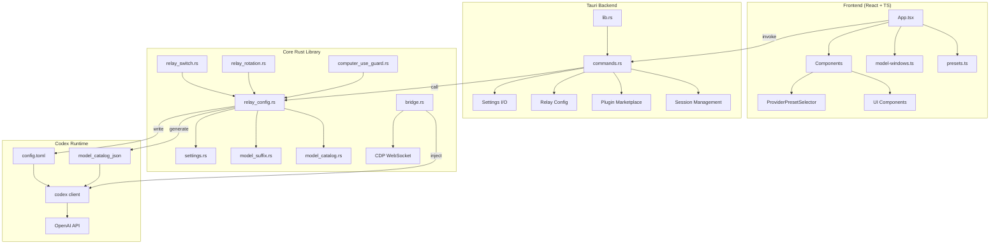
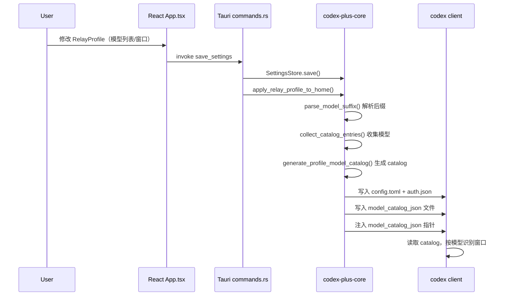
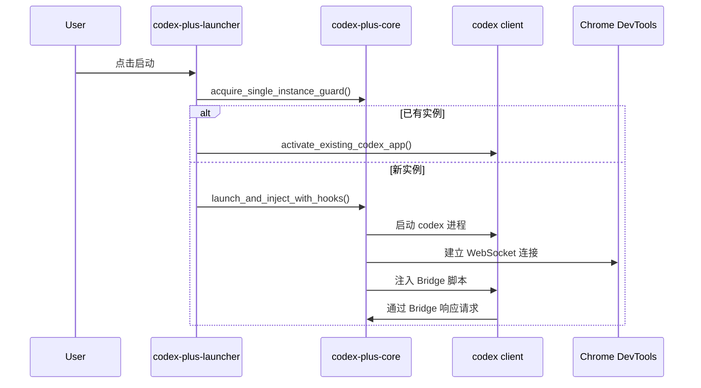
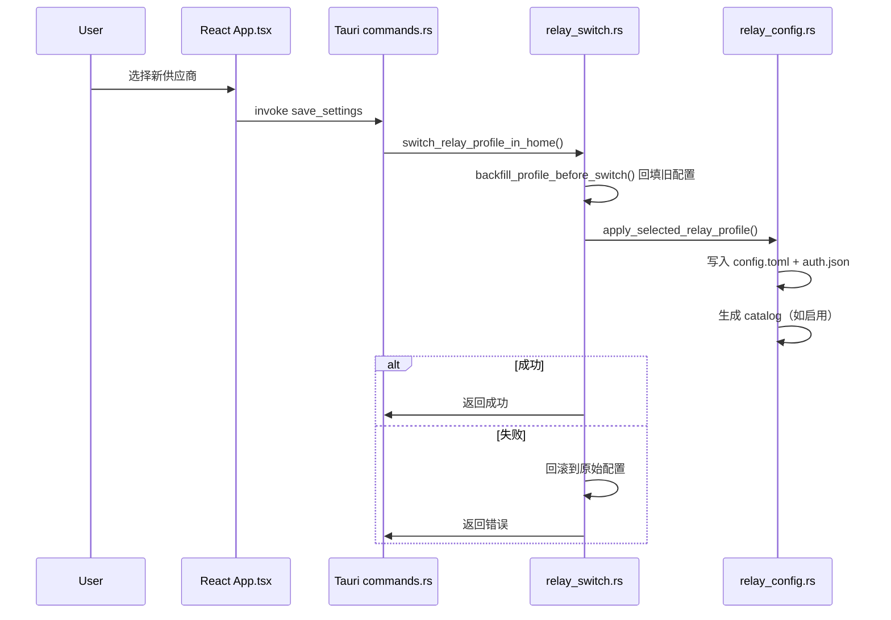

# CodexPlusPlus 架构设计文档

> 生成时间：2026-07-02
> 基于代码仓库分析，覆盖核心 crate、前端应用、数据流与交互机制

---

## 一、项目概述

**CodexPlusPlus** 是 [BigPizzaV3/CodexPlusPlus](https://github.com/BigPizzaV3/CodexPlusPlus) 的 fork，目标实现「按模型粒度配置上下文窗口与自动压缩阈值」（对应 issue #1171 / #931）。

采用 codex 原生 `model_catalog_json` 机制：通过 `model_list` 后缀语法（如 `deepseek-v4-pro[1M]`）声明每模型窗口，由 CodexPlusPlus 生成 catalog 文件并注入 config.toml 指针，codex 客户端运行时按模型识别各自窗口。

---

## 二、整体架构图



---

## 三、模块分层架构

### 3.1 数据层（Data Layer）

| 模块 | 文件 | 职责 |
|------|------|------|
| SettingsStore | `crates/codex-plus-core/src/settings.rs` | 持久化 JSON 配置读写，定义 RelayProfile/BackendSettings 等核心数据结构 |
| StatusStore | `crates/codex-plus-core/src/status.rs` | 启动状态、诊断日志存储 |
| codex-plus-data | `crates/codex-plus-data/` | SQLite 数据持久化（会话、历史记录等） |

### 3.2 业务逻辑层（Business Logic Layer）

| 模块 | 文件 | 职责 |
|------|------|------|
| Relay Config | `crates/codex-plus-core/src/relay_config.rs` | 将 RelayProfile 翻译为 codex config.toml/auth.json，核心 apply 流程 |
| Model Suffix | `crates/codex-plus-core/src/model_suffix.rs` | 解析 `[1M]` 后缀语法，生成 catalog JSON |
| Model Catalog | `crates/codex-plus-core/src/model_catalog.rs` | 读取/解析 codex model_catalog_json，提取模型列表 |
| Relay Switch | `crates/codex-plus-core/src/relay_switch.rs` | 供应商切换编排：校验、回填、写入、回滚 |
| Relay Rotation | `crates/codex-plus-core/src/relay_rotation.rs` | 聚合供应商轮转：Failover/轮询/加权策略 |
| Bridge | `crates/codex-plus-core/src/bridge.rs` | CDP WebSocket 桥接，注入 JS 脚本实现前后端互通 |
| Computer Use Guard | `crates/codex-plus-core/src/computer_use_guard.rs` | Windows 平台 computer-use 插件运行时兼容处理 |

### 3.3 应用层（Application Layer）

| 模块 | 文件 | 职责 |
|------|------|------|
| Manager App | `apps/codex-plus-manager/` | Tauri 桌面管理工具，React+TS 前端 |
| Launcher | `apps/codex-plus-launcher/` | Codex 启动器，单实例守卫、进程管理、Bridge 注入 |
| Mobile Relay | `apps/codex-plus-mobile-relay/` | 移动端 relay 服务 |

### 3.4 前端组件层（Presentation Layer）

| 组件 | 文件 | 职责 |
|------|------|------|
| App.tsx | `apps/codex-plus-manager/src/App.tsx` | 主界面：路由、状态管理、所有功能面板 |
| ProviderPresetSelector | `components/ProviderPresetSelector.tsx` | 供应商预设选择器，按分类浏览和搜索 |
| UI 组件 | `components/ui/` | Badge、Button、Card、Input、Label、Textarea 等基础组件 |
| model-windows.ts | `apps/codex-plus-manager/src/model-windows.ts` | modelList 与 modelWindows JSON 的序列化/反序列化、行数校验 |
| presets.ts | `apps/codex-plus-manager/src/presets.ts` | 供应商预设数据（官方、中国官方、聚合/中转、第三方） |

---

## 四、核心数据流

### 4.1 配置生效流程（Apply Flow）



### 4.2 启动流程（Launch Flow）



### 4.3 供应商切换流程（Switch Flow）



---

## 五、关键技术决策

### 5.1 model_catalog_json 机制

- **根因**：codex 客户端二进制硬编码 `context_window: 272000`，custom provider slug 不在内置列表 → 回落默认值
- **解法**：通过 `model_catalog_json` 指向外部 catalog 文件，覆盖编译默认值
- **验证**：Mac 相对路径在 config.toml 场景生效；`context_window` + `max_context_window` 字段有效；`effective_context_window_percent` 显式写 100 让显示值为真实窗口

### 5.2 后缀语法 → 分离设计演进

| 阶段 | 方案 | 问题 | 解决 |
|------|------|------|------|
| 阶段一 | `model_list` 后缀语法 `[1M]` | 功能正确，但历史记录污染 | 功能可用，作为过渡 |
| 阶段三 | `model_list` + `model_windows` 分离 | 彻底避免 Codex 接触带后缀字符串 | 当前目标方案 |

### 5.3 Template Clone 生成 Catalog

- 从 `codex debug models --bundled` 取 codex 自带 entry 做模板
- 覆盖 `slug` / `context_window` / `max_context_window` 等字段
- 保证字段齐全通过 codex schema 校验

### 5.4 聚合供应商轮转策略

| 策略 | 说明 |
|------|------|
| Failover | 主供应商失败时切换到备用 |
| ConversationRoundRobin | 按对话轮询分配 |
| RequestRoundRobin | 按请求轮询分配 |
| WeightedRoundRobin | 按权重分配 |

---

## 六、文件组织与依赖关系

```
Cargo.toml (workspace)
├── crates/codex-plus-core/
│   ├── src/
│   │   ├── lib.rs              # 模块导出
│   │   ├── settings.rs         # 数据模型 + 持久化
│   │   ├── relay_config.rs     # 配置翻译 + apply 流程
│   │   ├── model_suffix.rs     # 后缀解析 + catalog 生成
│   │   ├── model_catalog.rs    # catalog 读取 + 解析
│   │   ├── relay_switch.rs     # 供应商切换编排
│   │   ├── relay_rotation.rs   # 聚合供应商轮转
│   │   ├── bridge.rs           # CDP WebSocket 桥接
│   │   ├── computer_use_guard.rs # Windows 兼容
│   │   └── ...
│   └── tests/
│       └── relay_config.rs     # 集成测试
├── crates/codex-plus-data/
│   └── src/                    # SQLite 持久化
├── apps/codex-plus-launcher/
│   └── src/main.rs             # 启动器入口
├── apps/codex-plus-manager/
│   ├── src/
│   │   ├── App.tsx             # 前端主界面
│   │   ├── model-windows.ts    # 窗口配置工具
│   │   ├── presets.ts          # 供应商预设
│   │   └── components/         # UI 组件
│   └── src-tauri/src/
│       ├── main.rs             # Tauri 入口
│       ├── lib.rs              # Tauri 应用构建
│       └── commands.rs         # 命令实现
└── apps/codex-plus-mobile-relay/
    └── src/                    # 移动端 relay
```

---

## 七、测试策略

| 测试类型 | 位置 | 说明 |
|----------|------|------|
| 单元测试 | `crates/codex-plus-core/tests/` | 后缀解析、catalog 生成、配置写入 |
| 集成测试 | `relay_config.rs` | 断言 config.toml 文本包含预期字段 |
| 前端测试 | `model-windows.test.ts` | 行数校验、JSON 组装 |
| 实跑验证 | 手动 | `codex debug models` 确认窗口值 |

---

## 八、与上游同步策略

- `upstream` = https://github.com/BigPizzaV3/CodexPlusPlus.git
- feature 分支命名：`codex/per-model-context`
- 定期 `git fetch upstream && git rebase upstream/main`
- 目标：全栈完成后向主仓提 PR 合并
