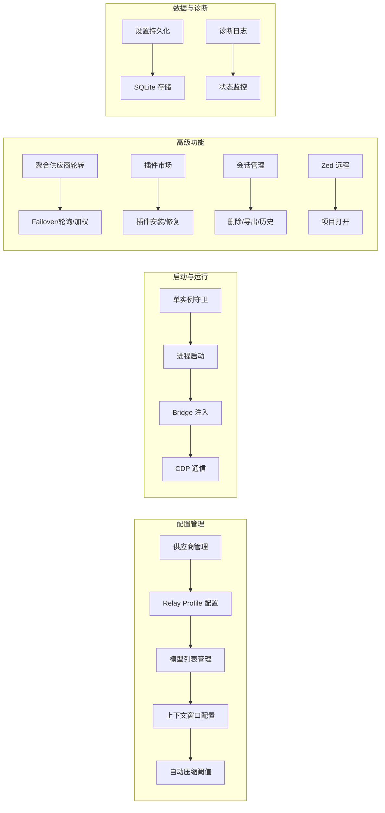
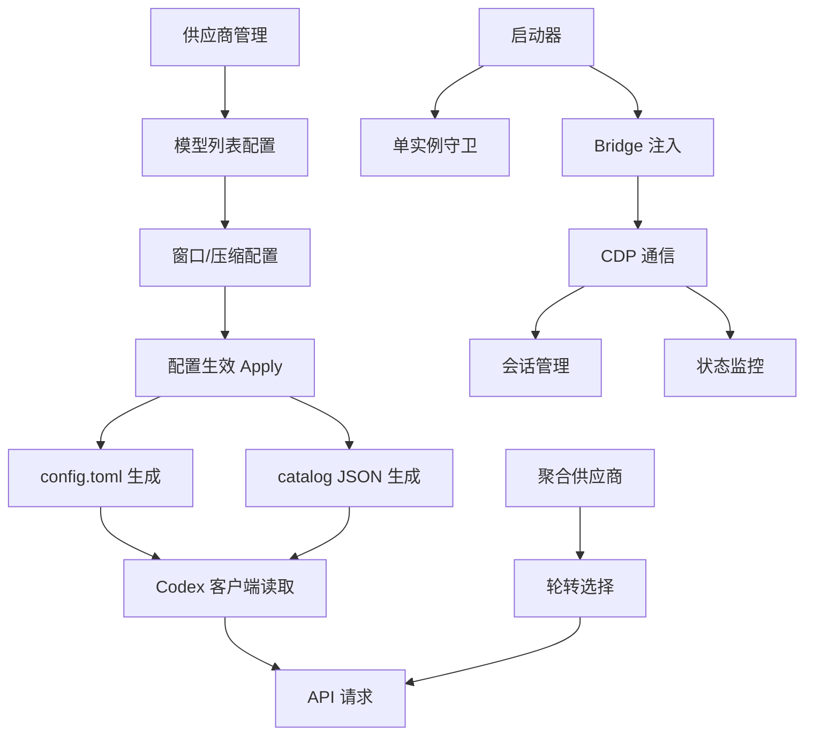

# CodexPlusPlus 功能模型分析

> 生成时间：2026-07-02

---

## 一、功能全景图



---

## 二、核心功能模块详解

### 2.1 供应商管理（Provider Management）

**功能描述**：管理 OpenAI API 兼容供应商的配置，包括官方、中国官方、聚合/中转、第三方等分类。

**涉及文件**：
- `apps/codex-plus-manager/src/presets.ts` — 预设数据
- `crates/codex-plus-core/src/settings.rs` — RelayProfile 数据模型
- `crates/codex-plus-core/src/provider_import.rs` — 供应商导入
- `crates/codex-plus-core/src/ccs_import.rs` — cc-switch 供应商导入

**关键数据结构**：
```rust
pub struct RelayProfile {
    pub id: String,
    pub name: String,
    pub base_url: String,
    pub upstream_base_url: String,
    pub api_key: String,
    pub protocol: RelayProtocol,
    pub relay_mode: RelayMode,
    pub test_model: String,
    pub context_window: String,
    pub auto_compact_limit: String,
    pub model_list: String,
    pub model_windows: String,  // 新增：按模型窗口配置
    // ...
}
```

**操作流程**：
1. 用户选择预设或手动输入供应商信息
2. 填写 Base URL、API Key、模型列表
3. 配置上下文窗口（全局或按模型）
4. 保存 → 写入 settings.json → apply 到 config.toml

---

### 2.2 模型列表与窗口配置（Model List & Window Config）

**功能描述**：按模型粒度配置上下文窗口，支持后缀语法和分离式双字段设计。

**涉及文件**：
- `crates/codex-plus-core/src/model_suffix.rs` — 后缀解析与 catalog 生成
- `crates/codex-plus-core/src/model_catalog.rs` — catalog 读取与解析
- `apps/codex-plus-manager/src/model-windows.ts` — 前端窗口配置工具
- `apps/codex-plus-manager/src/App.tsx` — UI 交互

**两种配置模式**：

| 模式 | 存储方式 | 适用场景 |
|------|----------|----------|
| 后缀语法 | `model_list` 含 `[1M]` | 快速配置、过渡兼容 |
| 分离字段 | `model_list` + `model_windows` JSON | 清晰管理、避免污染 |

**窗口值解析规则**：
- `1M` / `1m` → 1,000,000
- `200K` / `200k` → 200,000
- `1000000` → 1,000,000（纯数字）
- 空值 → 使用 Codex 默认窗口

---

### 2.3 配置生效（Apply Config）

**功能描述**：将 RelayProfile 翻译为 codex 可识别的 config.toml / auth.json。

**涉及文件**：
- `crates/codex-plus-core/src/relay_config.rs` — 核心 apply 逻辑
- `crates/codex-plus-core/src/relay_switch.rs` — 切换编排

**Apply 流程**：
```
complete_relay_profile_config
  ├── merge_common_config（合并通用配置）
  ├── preserve_unmanaged（保留用户自定义字段）
  ├── apply_context_limits_to_config（写入顶层单值窗口/压缩）
  ├── generate_profile_model_catalog（生成 catalog JSON）← 新增
  └── 落盘 config.toml + auth.json
```

**生成的 config.toml 关键字段**：
```toml
model = "deepseek-v4-pro"
model_context_window = 1000000
model_auto_compact_token_limit = 850000
model_catalog_json = "model-catalogs/<profile-id>.json"
```

**生成的 catalog JSON 结构**：
```json
[
  {
    "slug": "deepseek-v4-pro",
    "display_name": "DeepSeek V4 Pro",
    "description": "...",
    "context_window": 1000000,
    "max_context_window": 1000000,
    "effective_context_window_percent": 100,
    "auto_compact_token_limit": null,
    "priority": 100,
    "supported_reasoning_levels": ["low", "medium", "high"],
    "base_instructions": null,
    "additional_speed_tiers": [],
    "service_tiers": ["standard"],
    "availability_nux": null,
    "upgrade": null
  }
]
```

---

### 2.4 聚合供应商轮转（Aggregate Relay Rotation）

**功能描述**：将多个供应商聚合成一个逻辑供应商，支持多种负载均衡策略。

**涉及文件**：
- `crates/codex-plus-core/src/relay_rotation.rs` — 轮转选择器
- `crates/codex-plus-core/src/settings.rs` — AggregateRelayProfile

**策略对比**：

| 策略 | 机制 | 适用场景 |
|------|------|----------|
| Failover | 主失败切备用 | 高可用需求 |
| ConversationRoundRobin | 按对话 ID 哈希 | 会话粘性 |
| RequestRoundRobin | 轮询分配 | 均匀负载 |
| WeightedRoundRobin | 按权重分配 | 异构供应商 |

---

### 2.5 启动器（Launcher）

**功能描述**：管理 Codex 进程的启动、单实例守卫、Bridge 注入。

**涉及文件**：
- `apps/codex-plus-launcher/src/main.rs`
- `crates/codex-plus-core/src/launcher.rs`

**启动流程**：
1. 解析启动参数（`--helper-only`、debug port 等）
2. 尝试获取单实例守卫（端口锁 + 文件锁）
3. 若已有实例 → 激活现有窗口
4. 若新实例 → 启动 codex 进程 → 注入 Bridge 脚本 → 建立 CDP 连接
5. 启动 helper 服务（用于前端通信）

---

### 2.6 Bridge 通信（CDP Bridge）

**功能描述**：通过 Chrome DevTools Protocol 与 codex 前端建立双向通信。

**涉及文件**：
- `crates/codex-plus-core/src/bridge.rs`
- `crates/codex-plus-core/src/cdp.rs`

**通信能力**：
- 注入 JavaScript 脚本到 codex 页面
- 实现会话删除、状态查询、token 统计等功能
- 异步请求/响应模式（Promise-based）

---

### 2.7 插件市场（Plugin Marketplace）

**功能描述**：管理 codex 插件的安装、修复与状态监控。

**涉及文件**：
- `crates/codex-plus-core/src/plugin_marketplace.rs`
- `apps/codex-plus-manager/src-tauri/src/commands.rs`

**关键操作**：
- 修复本地插件市场（`repair_plugin_marketplace`）
- 修复远程插件市场（`repair_remote_plugin_marketplace`）
- 状态检查（`plugin_marketplace_status`）

---

### 2.8 会话管理（Session Management）

**功能描述**：管理 codex 本地会话的删除、导出、历史查询。

**涉及文件**：
- `crates/codex-plus-core/src/codex_sqlite.rs`
- `crates/codex-plus-data/src/`
- `crates/codex-plus-core/src/models.rs`

**数据存储**：
- SQLite 数据库：`~/.codex/state_5.sqlite`
- 表：`threads`、`messages`、`token_usage` 等

---

### 2.9 诊断与监控（Diagnostics）

**功能描述**：收集运行日志、诊断信息，辅助问题排查。

**涉及文件**：
- `crates/codex-plus-core/src/diagnostic_log.rs`
- `crates/codex-plus-core/src/status.rs`

**诊断能力**：
- 启动状态记录
- 错误日志收集
- 配置状态快照

---

## 三、功能依赖关系



---

## 四、功能状态矩阵

| 功能 | 状态 | 说明 |
|------|------|------|
| 供应商管理 | ✅ 稳定 | 预设 + 自定义供应商 |
| 模型列表配置 | ✅ 稳定 | 后缀语法已验证 |
| 按模型窗口配置 | 🔄 进行中 | 阶段三：分离字段 UI |
| 自动压缩阈值 | 🔄 进行中 | 阶段二：按比例/按模型 |
| 聚合供应商轮转 | ✅ 稳定 | 四种策略已验证 |
| 配置生效 Apply | ✅ 稳定 | 含 catalog 生成 |
| 启动器 | ✅ 稳定 | 单实例 + Bridge |
| 插件市场 | ✅ 稳定 | 本地/远程修复 |
| 会话管理 | ✅ 稳定 | 删除/导出/历史 |
| Zed 远程 | ✅ 稳定 | 项目打开 |
| 诊断日志 | ✅ 稳定 | 状态监控 |
