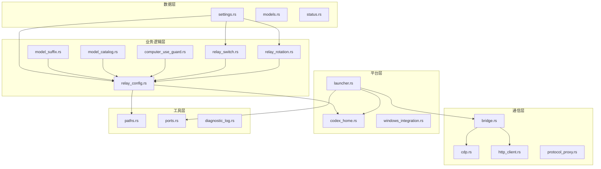

# Codex 模块功能分析

> 生成时间：2026-07-02
> 分析范围：codex-plus-core 核心库全部模块

---

## 一、模块总览

`codex-plus-core` 是 CodexPlusPlus 的核心 Rust 库，包含 30+ 个模块，覆盖配置管理、数据持久化、进程控制、网络通信、平台兼容等全栈能力。

```
crates/codex-plus-core/src/
├── lib.rs                    # 模块导出入口
├── settings.rs               # 数据模型与持久化 ⭐核心
├── relay_config.rs           # 配置翻译与生效 ⭐核心
├── model_suffix.rs           # 后缀解析与 catalog 生成 ⭐核心
├── model_catalog.rs          # catalog 读取与解析 ⭐核心
├── relay_switch.rs           # 供应商切换编排
├── relay_rotation.rs         # 聚合供应商轮转
├── bridge.rs                 # CDP WebSocket 桥接
├── cdp.rs                    # Chrome DevTools Protocol
├── launcher.rs               # 进程启动管理
├── codex_home.rs             # codex 主目录解析
├── codex_sqlite.rs           # SQLite 操作封装
├── codex_local_storage.rs    # localStorage 操作
├── computer_use_guard.rs     # Windows computer-use 兼容
├── plugin_marketplace.rs     # 插件市场管理
├── provider_import.rs        # 供应商导入
├── ccs_import.rs             # cc-switch 供应商导入
├── protocol_proxy.rs         # 协议代理
├── proxy.rs                  # HTTP 代理
├── http_client.rs            # HTTP 客户端
├── routes.rs                 # 路由定义
├── models.rs                 # 通用数据模型
├── status.rs                 # 状态存储
├── diagnostic_log.rs         # 诊断日志
├── env_conflicts.rs          # 环境变量冲突检测
├── ports.rs                  # 端口管理
├── paths.rs                  # 路径工具
├── app_paths.rs              # 应用路径
├── assets.rs                 # 资源管理
├── install                   # 安装相关
├── script_market.rs          # 脚本市场
├── user_scripts.rs           # 用户脚本
├── update.rs                 # 更新检查
├── version.rs                # 版本信息
├── watcher.rs                # 文件监控
├── native_menu.rs            # 原生菜单
├── windows_integration.rs    # Windows 平台集成
├── zed_remote.rs             # Zed 编辑器远程打开
├── stepwise.rs               # 逐步执行
├── cli_wrapper.rs            # CLI 包装器
├── upstream_worktree.rs      # 上游工作树
└── ads.rs                    # 广告/赞助
```

---

## 二、核心模块详细分析

### 2.1 settings.rs — 数据模型层

**职责**：定义全部核心数据结构，负责 JSON 配置文件的序列化/反序列化。

**关键结构体**：

| 结构体 | 说明 |
|--------|------|
| `RelayProfile` | 单个供应商配置（Base URL、API Key、模型列表、窗口配置等） |
| `BackendSettings` | 后端总设置（供应商列表、激活 ID、聚合配置等） |
| `AggregateRelayProfile` | 聚合供应商配置（成员列表、轮转策略） |
| `RelayContextSelection` | 上下文选择（MCP servers、skills、plugins） |
| `SettingsStore` | 设置持久化读写器 |

**关键字段（按模型窗口 feature）**：
```rust
pub struct RelayProfile {
    // ... 现有字段 ...
    #[serde(rename = "modelList", default)]
    pub model_list: String,           // 每行一个模型 slug
    #[serde(rename = "modelWindows", default, skip_serializing_if = "String::is_empty")]
    pub model_windows: String,        // JSON map: slug -> 窗口 token
    #[serde(rename = "contextWindow", default)]
    pub context_window: String,       // 全局默认窗口
    #[serde(rename = "autoCompactLimit", default)]
    pub auto_compact_limit: String,   // 全局压缩阈值
}
```

**数据流向**：
```
Frontend (React) → Tauri commands → SettingsStore.save() → ~/.codex-plus-plus/settings.json
                                                            ↓
Frontend (React) ← Tauri commands ← SettingsStore.load() ←
```

---

### 2.2 relay_config.rs — 配置翻译层

**职责**：将 `RelayProfile` 翻译为 codex 的 `config.toml` / `auth.json` 实际文件内容。

**核心函数**：

| 函数 | 说明 |
|------|------|
| `apply_relay_profile_to_home_with_switch_rules_and_computer_use_guard` | 主入口：应用 profile 到 codex home |
| `complete_relay_profile_config` | 组装完整 config.toml 内容 |
| `apply_context_limits_to_config` | 写入顶层单值窗口/压缩配置 |
| `generate_profile_model_catalog` | 生成 model_catalog_json 文件 ← 新增 |
| `relay_status_from_home` | 读取当前 relay 状态 |

**Apply 流程详解**：
```rust
pub fn apply_relay_profile_to_home_with_switch_rules_and_computer_use_guard(
    home: &Path,
    profile: &RelayProfile,
    common_config: &str,
) -> anyhow::Result<RelayApplyResult> {
    // 1. 组装完整配置
    let config = complete_relay_profile_config(home, profile, common_config)?;
    
    // 2. 应用上下文限制（顶层单值）
    apply_context_limits_to_config(&mut config, profile)?;
    
    // 3. 生成 catalog（新增步骤）
    generate_profile_model_catalog(home, profile)?;
    
    // 4. 写入 config.toml
    // 5. 写入 auth.json
    // 6. 处理 computer_use_guard（Windows）
}
```

**config.toml 生成规则**：
- `model`：当前配置模型（剥离后缀）
- `model_context_window`：全局默认窗口
- `model_auto_compact_token_limit`：全局压缩阈值
- `model_catalog_json`：指向生成的 catalog 文件（相对路径）

---

### 2.3 model_suffix.rs — 后缀解析与 catalog 生成

**职责**：实现 `model_list` 后缀语法解析、旧数据迁移、以及 `model_catalog_json` 生成。

**核心函数**：

| 函数 | 说明 |
|------|------|
| `parse_model_suffix(raw)` | 解析 `deepseek-v4-pro[1M]` → `(slug, Option<window>)` |
| `migrate_model_list_with_suffixes(model_list)` | 旧格式迁移：拆分后缀到 `model_windows` map |
| `collect_catalog_entries(model_list, model_windows)` | 收集全部模型条目（含窗口） |
| `generate_profile_model_catalog(home, profile)` | 生成完整 catalog JSON 文件 |

**后缀解析规则**：
```rust
// 输入: "deepseek-v4-pro[1M]"
// 输出: ("deepseek-v4-pro", Some(1000000))

// 输入: "claude-sonnet-4[200K]"
// 输出: ("claude-sonnet-4", Some(200000))

// 输入: "gpt-4o"
// 输出: ("gpt-4o", None)  // 无后缀，使用默认窗口
```

**窗口 token 解析**：
- `K`/`k` → ×1,000
- `M`/`m` → ×1,000,000
- 纯数字 → 原值
- 非法/0 → None

**Catalog 生成逻辑**：
1. 从 `codex debug models --bundled` 取模板 entry（gpt-5.5）
2. 克隆模板，覆盖以下字段：
   - `slug`：无后缀模型名
   - `context_window`：模型窗口值
   - `max_context_window`：同 `context_window`
   - `effective_context_window_percent`：100（显示真实窗口）
   - `auto_compact_token_limit`：null（使用 codex 默认比例）
3. 写入 `~/.codex/model-catalogs/<profile-id>.json`
4. 返回相对路径供 config.toml 引用

---

### 2.4 model_catalog.rs — catalog 读取与解析

**职责**：读取 codex 的 `model_catalog_json` 文件，提取模型列表与状态。

**核心函数**：

| 函数 | 说明 |
|------|------|
| `read_codex_model_catalog()` | 异步读取当前 catalog 状态 |
| `parse_model_catalog_json_models(catalog_path)` | 解析 catalog JSON，提取模型列表 |
| `relay_profile_model_catalog_value(home, profile)` | 从 profile 构建 catalog 状态值 |

**当前限制（待阶段二解决）**：
- `parse_model_catalog_json_models` 只取 `slug`，丢弃 `context_window`
- 前端无法按模型显示真实窗口

**阶段二改进方向**：
- 保留 `context_window` 字段回传前端
- 支持 `auto_compact_token_limit` 按模型读取

---

### 2.5 relay_switch.rs — 供应商切换编排

**职责**：处理供应商切换的完整生命周期：校验 → 回填 → 写入 → 回滚。

**核心函数**：

| 函数 | 说明 |
|------|------|
| `switch_relay_profile_in_home()` | 主入口：切换供应商 |
| `backfill_profile_before_switch()` | 回填旧配置到 profile |
| `apply_selected_relay_profile()` | 应用选中的供应商配置 |

**切换流程**：
```
1. 校验：供应商总开关是否开启
2. 回填：将当前 config.toml 内容回填到旧 profile（防止丢失用户修改）
3. 保存：写入新的 settings.json
4. 应用：调用 relay_config.rs 写入 config.toml + auth.json
5. 回滚：若失败，恢复原始 settings
```

---

### 2.6 relay_rotation.rs — 聚合供应商轮转

**职责**：实现聚合供应商的负载均衡选择器。

**核心结构体**：

| 结构体 | 说明 |
|--------|------|
| `RelayRotationSelector` | 轮转选择器（含状态维护） |
| `RotationContext` | 轮转上下文（对话 ID 等） |
| `RotationEvent` | 轮转事件（成功/失败） |

**四种策略实现**：

```rust
pub enum AggregateRelayStrategy {
    Failover,                // 顺序尝试，失败切换
    ConversationRoundRobin,  // 对话级轮询
    RequestRoundRobin,       // 请求级轮询
    WeightedRoundRobin,      // 加权轮询
}
```

**状态维护**：
- 全局静态 `ROTATION_STATE`：HashMap<aggregate_id, selector>
- 记录成功/失败事件，用于 Failover 策略的索引调整

---

### 2.7 bridge.rs — CDP WebSocket 桥接

**职责**：通过 Chrome DevTools Protocol 与 codex 前端建立双向通信。

**核心机制**：

| 组件 | 说明 |
|------|------|
| `build_bridge_script` | 生成注入 codex 的 JS 脚本 |
| `evaluate_script` | 通过 CDP 执行 JS 并获取结果 |
| `BridgeHandler` | 异步请求处理器类型 |

**Bridge 脚本功能**：
```javascript
// 注入到 codex 页面的全局对象
window.__codexSessionDeleteBridge(path, payload) → Promise<result>
```

**支持的操作**：
- `/backend/status` — 查询后端状态
- `/sessions/delete` — 删除会话
- `/sessions/export` — 导出会话
- `/token_usage` — 查询 token 使用统计

---

### 2.8 computer_use_guard.rs — Windows 兼容层

**职责**：处理 Windows 平台 computer-use 插件的运行时兼容问题。

**关键操作**：
- 查找 `codex-computer-use.exe`
- 修复 `package.json` 的 exports 字段
- 确保 `openai-bundled` 插件市场可用

**平台限制**：
- 仅 Windows 生效（`#[cfg(windows)]`）
- 非 Windows 平台返回空 GuardArtifacts

---

### 2.9 launcher.rs — 进程启动管理

**职责**：管理 codex 进程的启动、监控、注入。

**核心函数**：

| 函数 | 说明 |
|------|------|
| `launch_and_inject_with_hooks` | 启动 codex 并注入 hooks |
| `DefaultLaunchHooks` | 默认启动钩子 |
| `LaunchOptions` | 启动参数 |

**启动参数**：
- `helper_port`：helper 服务端口
- `debug_port`：调试端口
- `user_scripts`：用户脚本列表
- `zed_remote`：Zed 远程打开配置

---

### 2.10 codex_sqlite.rs / codex_local_storage.rs — 数据操作

**职责**：直接操作 codex 的 SQLite 数据库和 localStorage。

**SQLite 操作**：
- 读取 `state_5.sqlite` 的 `threads` 表
- 删除指定会话
- 查询 token 使用统计

**localStorage 操作**：
- 清理 `__codexDailyTokenUsageV1`（token 使用缓存）
- 清理历史记录中的带后缀 model ID

---

## 三、模块依赖关系图



---

## 四、关键接口定义

### 4.1 Tauri 命令接口（Frontend ↔ Backend）

```rust
// 设置管理
#[tauri::command]
pub fn load_settings() -> CommandResult<SettingsPayload>

#[tauri::command]
pub fn save_settings(settings: BackendSettings) -> CommandResult<SettingsPayload>

// 启动管理
#[tauri::command]
pub fn launch_codex_plus(request: LaunchRequest) -> CommandResult<Value>

#[tauri::command]
pub fn restart_codex_plus(request: LaunchRequest) -> CommandResult<Value>

// 会话管理
#[tauri::command]
pub fn list_local_sessions() -> CommandResult<LocalSessionsPayload>

#[tauri::command]
pub fn delete_local_session(request: DeleteLocalSessionRequest) -> CommandResult<DeleteResult>

// 插件市场
#[tauri::command]
pub fn plugin_marketplace_status() -> CommandResult<PluginMarketplaceStatusPayload>

#[tauri::command]
pub async fn repair_plugin_marketplace() -> CommandResult<PluginMarketplaceRepairPayload>
```

### 4.2 核心库公共接口（Rust API）

```rust
// settings.rs
pub struct SettingsStore { ... }
impl SettingsStore {
    pub fn new(path: PathBuf) -> Self;
    pub fn load(&self) -> anyhow::Result<BackendSettings>;
    pub fn save(&self, settings: &BackendSettings) -> anyhow::Result<()>;
}

// relay_config.rs
pub fn apply_relay_profile_to_home(
    home: &Path,
    profile: &RelayProfile,
) -> anyhow::Result<RelayApplyResult>

pub fn relay_status_from_home(home: &Path) -> RelayStatus

// model_suffix.rs
pub fn parse_model_suffix(raw: &str) -> (String, Option<u64>)
pub fn migrate_model_list_with_suffixes(model_list: &str) -> (String, HashMap<String, String>)
pub fn collect_catalog_entries(
    model_list: &str,
    model_windows: &HashMap<String, String>,
) -> Vec<ModelCatalogEntry>

// bridge.rs
pub async fn evaluate_script(websocket_url: &str, script: &str) -> anyhow::Result<Value>
pub fn build_bridge_script(binding_name: &str) -> String
```

---

## 五、模块成熟度评估

| 模块 | 成熟度 | 说明 |
|------|--------|------|
| settings.rs | ⭐⭐⭐⭐⭐ | 稳定，数据模型完整 |
| relay_config.rs | ⭐⭐⭐⭐⭐ | 稳定，含 catalog 生成 |
| model_suffix.rs | ⭐⭐⭐⭐☆ | 核心功能完成，待分离字段适配 |
| model_catalog.rs | ⭐⭐⭐☆☆ | 读取完成，待回传 context_window |
| relay_switch.rs | ⭐⭐⭐⭐⭐ | 稳定，含回滚机制 |
| relay_rotation.rs | ⭐⭐⭐⭐⭐ | 稳定，四种策略已验证 |
| bridge.rs | ⭐⭐⭐⭐⭐ | 稳定，CDP 通信可靠 |
| computer_use_guard.rs | ⭐⭐⭐⭐☆ | Windows 专用，功能完整 |
| launcher.rs | ⭐⭐⭐⭐⭐ | 稳定，单实例 + 注入 |
| codex_sqlite.rs | ⭐⭐⭐⭐☆ | 功能完整，待扩展 |

---

## 六、待完成工作（按阶段）

### 阶段二（后端完整化）
- [ ] `model_catalog.rs` 保留 `context_window` 回传前端
- [ ] 支持 `auto_compact_token_limit` 按模型/按比例
- [ ] 决定 `effective_context_window_percent` 策略

### 阶段三（前端全栈 + PR）
- [ ] 前端结构化 model_list 编辑器（分离字段 UI）
- [ ] 后缀实时高亮/校验
- [ ] 窗口可视化展示
- [ ] auto_compact UI
- [ ] 兼容性回归测试
- [ ] 提 PR 合并主仓
